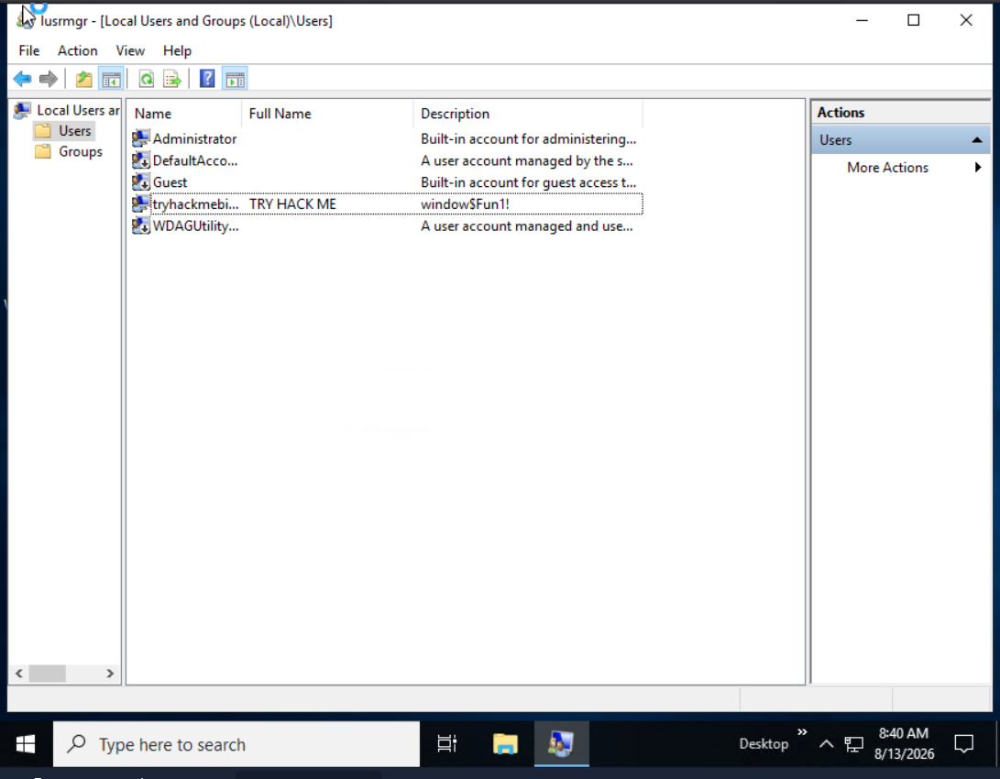
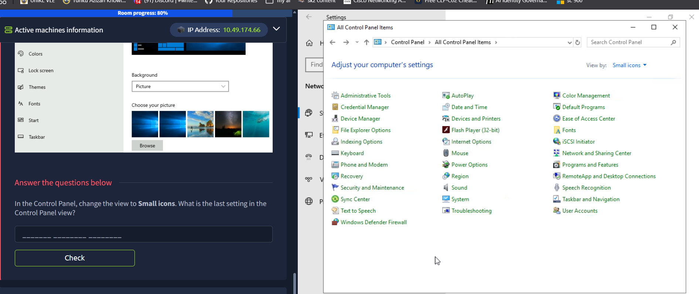

# TryHackMe — Windows Fundamentals 1

## Room Objective

The objective of this room is to build a foundational understanding of the Windows operating system, including Windows editions, the graphical user interface (GUI), file systems, system directories, user accounts, permissions, User Account Control (UAC), system settings, and Task Manager.

This room provides foundational knowledge that is important for understanding Windows administration, system security, access control, and common areas that may be relevant during security assessments.

---

## Concepts Learned

- Windows editions and security features
- Windows Desktop and Graphical User Interface (GUI)
- Start Menu and Taskbar
- Windows Notification Area
- NTFS file system
- NTFS permissions
- Alternate Data Streams (ADS)
- Windows environment variables
- `System32` directory
- Local user accounts and groups
- User profiles
- Administrator vs Standard User privileges
- User Account Control (UAC)
- Windows Settings and Control Panel
- Task Manager
- Basic Windows security considerations

---

# Task 1 — Windows Editions

## Concepts Learned

Windows has been widely used in both personal and corporate environments since its introduction in 1985. Due to its widespread adoption, Windows systems have historically been common targets for malware and attackers.

Microsoft has released many Windows versions over the years, including Windows XP, Vista, 7, 8.x, 10, and 11. Each generation introduced changes to usability, administration, and security.

### Current Windows Versions

- **Windows 11** — Current Windows operating system for desktop end users.
- **Windows 11 Home** — Consumer-focused edition.
- **Windows 11 Pro** — Provides additional security and management capabilities.
- **Windows Server 2025** — Current Windows Server release.

> **THM VM:** The attached virtual machine uses **Windows Server 2019 Standard**, as shown in System Information.

### Windows 11 Home vs Pro

Windows 11 Home and Pro provide many common security features, including:

- Device encryption
- Find My Device
- Firewall and network protection
- Internet protection
- Parental controls
- Secure Boot
- Windows Hello
- Windows Security

Windows 11 Pro additionally provides features such as **BitLocker Drive Encryption**.

### Key Security Concept — BitLocker

**BitLocker Drive Encryption** protects data stored on a device by encrypting the drive. This helps prevent unauthorized access to data if a device is lost or stolen.

## THM Question

**What encryption can you enable on Pro that you can't enable in Home?**

**Answer:** `BitLocker`

## Security Observation

Full-disk encryption is an important security control for protecting sensitive data at rest. If a device is physically lost or stolen, encryption can make it significantly more difficult for an unauthorized party to access the stored data.

---

# Task 2 — The Desktop (GUI)

## Concepts Learned

The Windows Desktop, also known as the **Graphical User Interface (GUI)**, is the primary interface presented after successfully logging into a Windows system.

The Windows GUI includes several important components:

- Desktop
- Start Menu
- Search Box
- Task View
- Taskbar
- Toolbars
- Notification Area

### Desktop

The Desktop provides quick access to shortcuts, folders, files, and applications.

### Start Menu

The Start Menu provides access to:

- Installed applications
- Recently added applications
- User account options
- Settings
- Documents
- Pictures
- Power and session controls

### Taskbar

The Taskbar displays currently open applications, folders, and files. Applications can also be pinned to the Taskbar for quick access.

### Notification Area

The Notification Area is generally located at the bottom-right of the Windows screen. It can display information such as:

- Date and time
- Network status
- Volume
- Other system notifications

## Hands-on Tasks

The room required navigating the Windows GUI and modifying or identifying different desktop components.

### Question 1

**Which selection will hide/disable the Search box?**

**Answer:** `Hidden`

### Question 2

**Which selection will hide/disable the Task View button?**

**Answer:** `Show Task View button`

### Question 3

**Besides Clock and Network, what other icon is visible in the Notification Area?**

**Answer:** `Action Center`

## Security Observation

Understanding the Windows GUI is useful during security investigations and system administration because many security-relevant settings, applications, and system information can be accessed through the graphical interface.

---

# Task 3 — Introduction to Windows

## Concepts Learned

Windows has evolved through multiple major versions, with each version introducing changes to functionality, usability, and security.

The Windows operating system is widely deployed across:

- Personal computers
- Corporate environments
- Enterprise infrastructure
- Servers

Because Windows is extensively used in organizations, Windows security knowledge is an important foundation for cybersecurity.

## Hands-on Tasks

The task involved starting and accessing the Windows virtual machine and reviewing the operating system environment.

## Security Observation

The widespread use of Windows makes Windows systems an important target for attackers and malware. Understanding the operating system and its security controls provides a foundation for identifying misconfigurations and potential attack surfaces.

---

# Task 4 — The File System

## Concepts Learned

- Windows uses NTFS (New Technology File System) — supports permissions, >4GB files, compression, EFS encryption, journaling.
- Permissions: Full control, Modify, Read & Execute, List folder contents, Read, Write (via Properties → Security tab).
- ADS (Alternate Data Streams): hidden extra data streams in NTFS files; not shown in Explorer; can be used to hide malicious data.

## THM Question

**What is the meaning of NTFS?**

**Answer:** `New Technology File System`

## Security Observation

NTFS permissions are an important part of Windows access control. Incorrect permissions can allow unauthorized users or processes to access, modify, or execute files.

Alternate Data Streams are also security-relevant because attackers and malware have historically used ADS to hide data or malicious content.

ADS is not inherently malicious, however. Windows can also use ADS for legitimate purposes, such as storing information associated with downloaded files.

---

# Task 5 — The Windows\System32 Folders

## Concepts Learned

The Windows operating system is traditionally stored under:

```text
C:\Windows
```
However, the Windows directory does not have to be located on the C: drive.

Windows provides environment variables that allow applications and administrators to reference system locations without relying on a fixed path.

### Windows Environment Variable

The system environment variable for the Windows directory is:

```text
%windir%
```
## THM Question

**What is the system variable for the Windows folder?**

**Answer:** `%windir%`

# Task 6 — User Accounts, Profiles, and Permissions

## Concepts Learned

Windows local systems commonly have two primary account types:

- **Administrator**
- **Standard User**

An Administrator can perform system-level actions such as:

- Adding or removing users
- Modifying groups
- Changing system settings
- Installing software

A Standard User has more restricted privileges and generally cannot perform system-level administrative actions without additional authorization.

### User Profiles

When a user logs into a Windows system for the first time, Windows creates a user profile under:

```text
C:\Users
```
## THM Questions

**Q1:** Other user account name → **A:** `tryhackmebilly`
**Q2:** Groups this user belongs to → **A:** `Remote Desktop Users, Users`
**Q3:** Built-in guest access account → **A:** `Guest`
**Q4:** Account description → **A:** `window$Fun1!`

## Security Observations

- User accounts & group membership drive Windows access control.
- Excessive privileges on a compromised account = more damage potential → apply least privilege.
- Review group membership carefully; users inherit that group's permissions.

## Evidence / Screenshots


---

# Task 7 — User Account Control

## Concepts Learned

User Account Control (UAC) is a Windows security feature designed to reduce unauthorized system-level changes.

Even when an Administrator is logged in, applications do not automatically run with elevated administrative privileges.

When an operation requires elevated privileges, Windows can display a UAC prompt requesting confirmation or administrative credentials.

For Standard Users, administrative credentials may be required before an elevated operation can proceed.

## THM Question

**What does UAC mean?**

**Answer:** `User Account Control`

## Security Observations

UAC helps reduce the risk of unauthorized system modifications by preventing applications from automatically receiving elevated privileges.

This demonstrates the importance of privilege separation between normal user activity and administrative operations.

UAC should not be treated as a complete security boundary. Other controls such as least privilege, application security, endpoint protection, and access control are still necessary.
---

# Task 8 — Settings and the Control Panel

## Concepts Learned

Windows provides two primary interfaces for configuring system settings:

- Settings
- Control Panel

The Control Panel has traditionally been used for more advanced system configuration, while the Settings application is the primary configuration interface in modern Windows versions.

### Programs and Features

Installed applications can be reviewed through:

```text
Control Panel → Programs → Programs and Features
```

This can provide information such as:

- Application name
- Publisher
- Version

## THM Question

**In the Control Panel, change the view to Small icons. What is the last setting in the Control Panel view?**

**Answer:** `Windows Defender Firewall`

## Security Observations

Reviewing installed applications can help identify unexpected or unauthorized software on a Windows system.

The Settings application and Control Panel also provide access to security-relevant configurations, making familiarity with both interfaces useful during system administration and security investigations.

## Evidence / Screenshots


---

# Task 9 — Task Manager

## Concepts Learned

Task Manager provides information about applications, processes, and system resource usage.

It can display information such as:

- Running applications
- Running processes
- CPU usage
- Memory usage
- System performance

Task Manager initially opens in a simplified view. Selecting More details provides additional information about running processes and system activity.

## Commands / Tools Used

**Keyboard Shortcut:** `Ctrl + Shift + Esc`

This shortcut directly opens Task Manager.

## THM Question

**What is the keyboard shortcut to open Task Manager?**

**Answer:** `Ctrl + Shift + Esc`

## Security Observations

Task Manager provides basic visibility into running processes and system activity.

During a security investigation, unfamiliar processes, unexpected applications, or unusual resource consumption may indicate activity that requires further investigation.

However, Task Manager alone is not sufficient for malware detection or incident response. It should be used together with other security tools and investigation techniques.